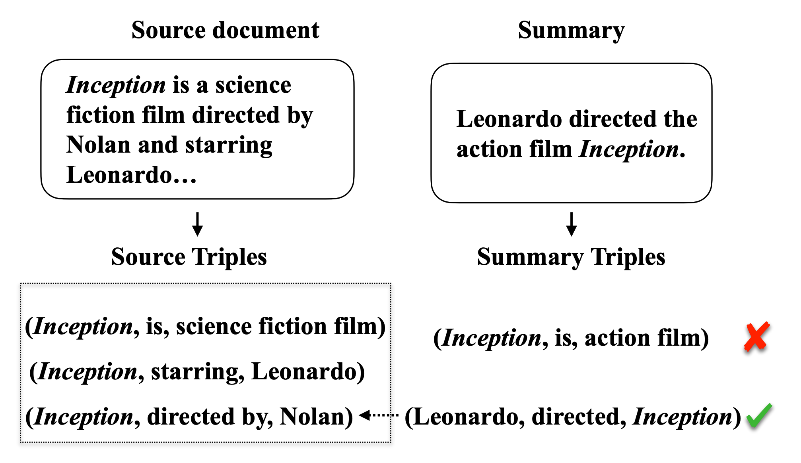
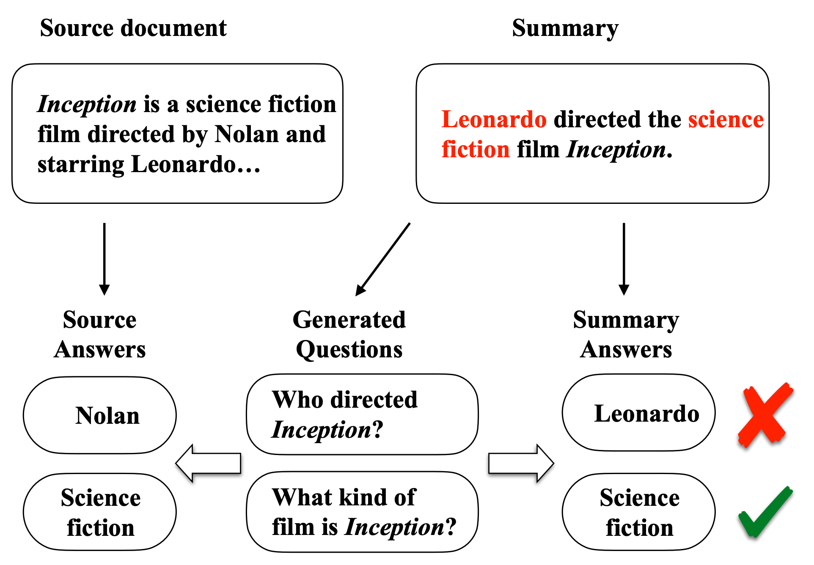

# FactSumm: Factual Consistency Scorer for Abstractive Summarization

`FactSumm` is a toolkit that scores *__Factualy Consistency__* for **Abstract Summarization**

Without fine-tuning, you can simply apply a variety of downstream tasks to both `the source article` and `the generated abstractive summary`



For example, by extracting **fact triples** from source articles and generated summaries, we can verify that generated summaries correctly reflect source-based facts ( *See image above* )

As you can guess, this *PoC-ish* project uses a lot of pre-trained modules that require __*super-duper*__ computing resources

So don't blame me, just take it as a concept project 👀

<br>

## Installation

You can install `factsumm` simply using `pip`:

```bash
pip install factsumm
```

Or you can install it from source repository:

```bash
git clone https://github.com/huffon/factsumm
cd factsumm
pip install .
```

<br>

## Usage

```python
>>> from factsumm import FactSumm
>>> factsumm = FactSumm()
>>> article = "Superman is a fictional superhero who first appeared in American comic books published by DC Comics. The character was created by writer Jerry Siegel and artist Joe Shuster, and first appeared in the comic book Action Comics #1. Superman has been adapted to a number of other media which includes radio serials, novels, movies, television shows and theatre. Although Superman was not the first superhero character, he popularized the superhero archetype and established its conventions. Superheroes are usually judged by how closely they resemble the standard set by Superman. He was the best-selling superhero character in American comic books up until the 1980s."
>>> summary = "Superman is a fictional superhero who first appeared in American comic books published by Marvel Comics. The character was created by writer Jerry Siegel and artist Joe Shuster. He popularized the superhero archetype and established its conventions. Superman has been adapted to a number of other media which includes radio serials, novels, movies, television shows and theatre."
>>> factsumm(article, summary) 
1: [('Superman', 'PER'), ('American', 'MISC'), ('DC Comics', 'ORG')]
2: [('Jerry Siegel', 'PER'), ('Joe Shuster', 'PER'), ('Action Comics', 'MISC')]
3: [('Superman', 'PER')]
4: [('Superman', 'PER')]
5: [('Superman', 'PER')]
6: [('American', 'MISC')]

SUMMARY Entities
1: [('Superman', 'PER'), ('American', 'MISC'), ('Marvel Comics', 'ORG')]
2: [('Jerry Siegel', 'PER'), ('Joe Shuster', 'PER')]
3: []
4: [('Superman', 'PER')]

SOURCE Facts
('American', 'per:alternate_names', 'Superman')
('Superman', 'per:employee_of', 'DC Comics')
('Superman', 'per:origin', 'American')
('DC Comics', 'org:country_of_headquarters', 'American')
('American', 'per:employee_of', 'DC Comics')

SUMMARY Facts
('Superman', 'per:employee_of', 'Marvel Comics')
('American', 'per:employee_of', 'Marvel Comics')
('Marvel Comics', 'org:country_of_headquarters', 'American')
('American', 'per:alternate_names', 'Superman')
('Superman', 'per:origin', 'American')

COMMON Facts
('Superman', 'per:origin', 'American')
('American', 'per:alternate_names', 'Superman')

DIFF Facts
('American', 'per:employee_of', 'Marvel Comics')
('Marvel Comics', 'org:country_of_headquarters', 'American')
('Superman', 'per:employee_of', 'Marvel Comics')

SOURCE Questions
[Q] What is the name of the fictional superhero that first appeared in comic books?     [A] Superman    [Pred] Superman
[Q] In what country did Superman first appear?  [A] American    [Pred] American
[Q] What company published Superman comics?     [A] DC Comics   [Pred] DC Comics
[Q] Who created the character?  [A] Jerry Siegel        [Pred] Jerry Siegel and artist Joe Shuster
[Q] Who created the character of the 'Action Comics'?   [A] Joe Shuster [Pred] Jerry Siegel and artist Joe Shuster
[Q] What comic book did the character first appear in?  [A] Action Comics       [Pred] Action Comics #1
[Q] What superhero has been adapted to a number of other media? [A] Superman    [Pred] Superman
[Q] What was the name of the first superhero?   [A] Superman    [Pred] Superman
[Q] Whose standard is a super hero compared to? [A] Superman    [Pred] Superman
[Q] What nationality was the character of the main character?   [A] American    [Pred] American

SUMMARY Questions
[Q] What is the name of the fictional superhero that first appeared in comic books?     [A] Superman    [Pred] Superman
[Q] In what country did Superman first appear?  [A] American    [Pred] American
[Q] What company published the first Superman comic book?       [A] Marvel Comics       [Pred] Marvel Comics
[Q] Who created the character?  [A] Jerry Siegel        [Pred] Jerry Siegel and artist Joe Shuster
[Q] Who created the character?  [A] Joe Shuster [Pred] Jerry Siegel and artist Joe Shuster
[Q] What superhero has been adapted to a number of other media? [A] Superman    [Pred] Superman
```

<br>

## Sub-modules

From [here](https://arxiv.org/pdf/2104.14839.pdf), you can find various way to score **Factual Consistency level** with *Unsupervised methods*

<br>

### Triple-based Factual Consistency

count the fact overlap between generated summary and the source document

not combination, but permutation

<br>

### QA-based Factual Consistency



If you ask questions about the summary and the source document, you will get a similar answer if the summary realistically matches the source document

<br>

## References

- [HuggingFace Transformers](https://github.com/huggingface/transformers)
- [BERTScore](https://github.com/Tiiiger/bert_score)
- [PySBD](https://github.com/nipunsadvilkar/pySBD)
- [The Factual Inconsistency Problem in Abstractive Text Summarization: A Survey](https://arxiv.org/pdf/2104.14839.pdf)
