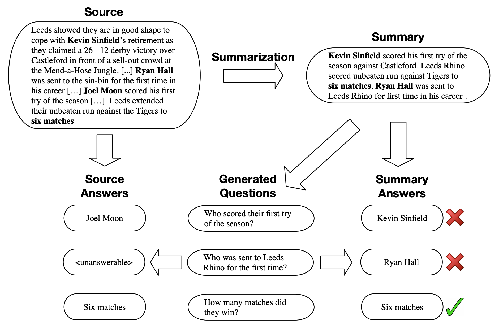

# FactSumm: Factual Consistency Scorer for Abstractive Summarization

<p align="center">
  <a href="https://github.com/huffon/factsumm/releases"></a>
  <a href="https://github.com/huffon/factsumm/blob/master/LICENSE"></a>
  <a href="https://github.com/huffon/factsumm/issues"></a>
</p>

`FactSumm` is a toolkit that scores _**Factualy Consistency**_ for **Abstract Summarization**

Without fine-tuning, you can simply apply a variety of downstream tasks to both `the source article` and `the generated abstractive summary`


For example, by extracting **fact triples** from source articles and generated summaries, you can verify that generated summaries correctly reflect source-based facts ( _See image above_ )

<br>

## Installation

With and _Python 3_ (>= 3.8), you can install `factsumm` simply using `pip`:

```bash
pip install factsumm
```

Or you can install `FactSumm` from source repository:

```bash
git clone https://github.com/huffon/factsumm
cd factsumm
pip install .
```

<br>

## Usage

```python
>>> from factsumm import FactSumm
>>> factsumm = FactSumm()
>>> article = "Lionel Andrés Messi (born 24 June 1987) is an Argentine professional footballer who plays as a forward and captains both Spanish club Barcelona and the Argentina national team. Often considered as the best player in the world and widely regarded as one of the greatest players of all time, Messi has won a record six Ballon d'Or awards, a record six European Golden Shoes, and in 2020 was named to the Ballon d'Or Dream Team."
>>> summary = "Lionel Andrés Messi (born 24 Aug 1997) is an Spanish professional footballer who plays as a forward and captains both Spanish club Barcelona and the Spanish national team."
>>> factsumm(article, summary, verbose=True)
SOURCE Entities
1: [('Lionel Andrés Messi', 'PERSON'), ('24 June 1987', 'DATE'), ('Argentine', 'NORP'), ('Spanish', 'NORP'), ('Barcelona',
'GPE'), ('Argentina', 'GPE')]
2: [('one', 'CARDINAL'), ('Messi', 'PERSON'), ('six', 'CARDINAL'), ('European Golden Shoes', 'WORK_OF_ART'), ('2020', 'DATE'),
("the Ballon d'Or Dream Team", 'ORG')]

SUMMARY Entities
1: [('Lionel Andrés Messi', 'PERSON'), ('24 Aug 1997', 'DATE'), ('Spanish', 'NORP'), ('Barcelona', 'ORG')]

SOURCE Facts
('Lionel Andrés Messi', 'per:origin', 'Argentine')
('Spanish', 'per:date_of_birth', '24 June 1987')
('Spanish', 'org:top_members/employees', 'Lionel Andrés Messi')
('Spanish', 'org:members', 'Barcelona')
('Lionel Andrés Messi', 'per:employee_of', 'Barcelona')
('Lionel Andrés Messi', 'per:date_of_birth', '24 June 1987')
('Barcelona', 'org:top_members/employees', 'Lionel Andrés Messi')

SUMMARY Facts
('Lionel Andrés Messi', 'per:origin', 'Spanish')
('Lionel Andrés Messi', 'per:date_of_birth', '24 Aug 1997')
('Spanish', 'per:date_of_birth', '24 Aug 1997')
('Spanish', 'org:top_members/employees', 'Lionel Andrés Messi')
('Spanish', 'org:members', 'Barcelona')
('Lionel Andrés Messi', 'per:employee_of', 'Barcelona')
('Barcelona', 'org:top_members/employees', 'Lionel Andrés Messi')

COMMON Facts
('Spanish', 'org:top_members/employees', 'Lionel Andrés Messi')
('Spanish', 'org:members', 'Barcelona')
('Lionel Andrés Messi', 'per:employee_of', 'Barcelona')
('Barcelona', 'org:top_members/employees', 'Lionel Andrés Messi')

DIFF Facts
('Lionel Andrés Messi', 'per:origin', 'Spanish')
('Lionel Andrés Messi', 'per:date_of_birth', '24 Aug 1997')
('Spanish', 'per:date_of_birth', '24 Aug 1997')

Fact Score: 0.5714285714285714

Answers based on SOURCE (Questions are generated from Summary)
[Q] Who is the captain of the Spanish national team?    [Pred] <unanswerable>
[Q] When was Lionel Andrés Messi born?  [Pred] 24 June 1987
[Q] Lionel Andrés Messi is a professional footballer of what nationality?       [Pred] Argentine
[Q] Lionel Messi is a captain of which Spanish club?    [Pred] Barcelona

Answers based on SUMMARY (Questions are generated from Summary)
[Q] Who is the captain of the Spanish national team?    [Pred] Lionel Andrés Messi
[Q] When was Lionel Andrés Messi born?  [Pred] 24 Aug 1997
[Q] Lionel Andrés Messi is a professional footballer of what nationality?       [Pred] Spanish
[Q] Lionel Messi is a captain of which Spanish club?    [Pred] Barcelona

QAGS Score: 0.3333333333333333

Avg. ROUGE-1: 0.4415584415584415
Avg. ROUGE-2: 0.3287671232876712
Avg. ROUGE-L: 0.4415584415584415

BERTScore Score
Precision: 0.9151781797409058
Recall: 0.9141832590103149
F1: 0.9150083661079407
```

You can use the GPU with the `device`. If you want to use GPU, pass `cuda` (default is `cpu`)

```python
>>> factsumm(article, summary, device="cuda")
```

<br>

## Sub-modules

From [here](https://arxiv.org/pdf/2104.14839.pdf), you can find various way to score **Factual Consistency level** with _Unsupervised methods_

<br>

### Triple-based Module ( _closed-scheme_ )

```python
>>> from factsumm import FactSumm
>>> factsumm = FactSumm()
>>> factsumm.extract_facts(article, summary, verbose=True)
SOURCE Entities
1: [('Lionel Andrés Messi', 'PERSON'), ('24 June 1987', 'DATE'), ('Argentine', 'NORP'), ('Spanish', 'NORP'), ('Barcelona',
'GPE'), ('Argentina', 'GPE')]
2: [('one', 'CARDINAL'), ('Messi', 'PERSON'), ('six', 'CARDINAL'), ('European Golden Shoes', 'WORK_OF_ART'), ('2020', 'DATE'),
("the Ballon d'Or Dream Team", 'ORG')]

SUMMARY Entities
1: [('Lionel Andrés Messi', 'PERSON'), ('24 Aug 1997', 'DATE'), ('Spanish', 'NORP'), ('Barcelona', 'ORG')]

SOURCE Facts
('Lionel Andrés Messi', 'per:origin', 'Argentine')
('Spanish', 'per:date_of_birth', '24 June 1987')
('Spanish', 'org:top_members/employees', 'Lionel Andrés Messi')
('Spanish', 'org:members', 'Barcelona')
('Lionel Andrés Messi', 'per:employee_of', 'Barcelona')
('Lionel Andrés Messi', 'per:date_of_birth', '24 June 1987')
('Barcelona', 'org:top_members/employees', 'Lionel Andrés Messi')

SUMMARY Facts
('Lionel Andrés Messi', 'per:origin', 'Spanish')
('Lionel Andrés Messi', 'per:date_of_birth', '24 Aug 1997')
('Spanish', 'per:date_of_birth', '24 Aug 1997')
('Spanish', 'org:top_members/employees', 'Lionel Andrés Messi')
('Spanish', 'org:members', 'Barcelona')
('Lionel Andrés Messi', 'per:employee_of', 'Barcelona')
('Barcelona', 'org:top_members/employees', 'Lionel Andrés Messi')

COMMON Facts
('Spanish', 'org:top_members/employees', 'Lionel Andrés Messi')
('Spanish', 'org:members', 'Barcelona')
('Lionel Andrés Messi', 'per:employee_of', 'Barcelona')
('Barcelona', 'org:top_members/employees', 'Lionel Andrés Messi')

DIFF Facts
('Lionel Andrés Messi', 'per:origin', 'Spanish')
('Lionel Andrés Messi', 'per:date_of_birth', '24 Aug 1997')
('Spanish', 'per:date_of_birth', '24 Aug 1997')

Fact Score: 0.5714285714285714
```

The triple-based module counts the overlap of fact triples between the generated summary and the source document.

<br>

### QA-based Module



If you ask questions about the summary and the source document, you will get a similar answer if the summary realistically matches the source document

```python
>>> from factsumm import FactSumm
>>> factsumm = FactSumm()
>>> factsumm.extract_qas(article, summary, verbose=True)
Answers based on SOURCE (Questions are generated from Summary)
[Q] Who is the captain of the Spanish national team?    [Pred] <unanswerable>
[Q] When was Lionel Andrés Messi born?  [Pred] 24 June 1987
[Q] Lionel Andrés Messi is a professional footballer of what nationality?       [Pred] Argentine
[Q] Lionel Messi is a captain of which Spanish club?    [Pred] Barcelona

Answers based on SUMMARY (Questions are generated from Summary)
[Q] Who is the captain of the Spanish national team?    [Pred] Lionel Andrés Messi
[Q] When was Lionel Andrés Messi born?  [Pred] 24 Aug 1997
[Q] Lionel Andrés Messi is a professional footballer of what nationality?       [Pred] Spanish
[Q] Lionel Messi is a captain of which Spanish club?    [Pred] Barcelona

QAGS Score: 0.3333333333333333
```

<br>

### ROUGE-based Module

```python
>>> from factsumm import FactSumm
>>> factsumm = FactSumm()
>>> factsumm.calculate_rouge(article, summary)
Avg. ROUGE-1: 0.4415584415584415
Avg. ROUGE-2: 0.3287671232876712
Avg. ROUGE-L: 0.4415584415584415
```

Simple but effective word-level overlap ROUGE score

<br>

### BERTScore Module

```python
>>> from factsumm import FactSumm
>>> factsumm = FactSumm()
>>> factsumm.calculate_bert_score(article, summary)
BERTScore Score
Precision: 0.9151781797409058
Recall: 0.9141832590103149
F1: 0.9150083661079407
```

[BERTScore](https://github.com/Tiiiger/bert_score) can be used to calculate the similarity between each source sentence and the summary sentence

<br>

### Citation

If you apply this library to any project, please cite:

```
@misc{factsumm,
  author       = {Heo, Hoon},
  title        = {FactSumm: Factual Consistency Scorer for Abstractive Summarization},
  howpublished = {\url{https://github.com/Huffon/factsumm}},
  year         = {2021},
}
```

<br>

## References

- [The Factual Inconsistency Problem in Abstractive Text Summarization: A Survey](https://arxiv.org/abs/2104.14839.pdf)
- [Assessing The Factual Accuracy of Generated Text](https://arxiv.org/abs/1905.13322.pdf)
- [Asking and Answering Questions to Evaluate the Factual Consistency of Summaries](https://arxiv.org/abs/2004.04228)
- [FEQA: A Question Answering Evaluation Framework for Faithfulness Assessment in Abstractive Summarization](https://arxiv.org/abs/2005.03754)
